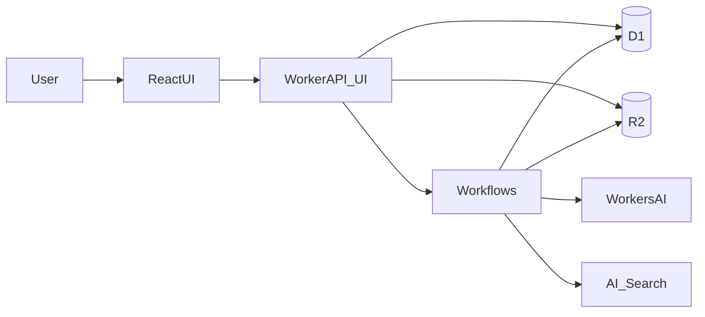
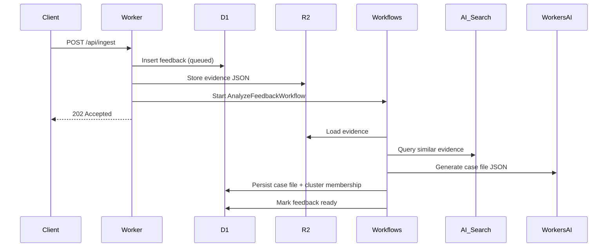

# Architecture overview

FFL uses Cloudflare Workers as the API + UI host, backed by D1 (metadata), R2 (raw evidence), Workflows (async orchestration), Workers AI (case-file extraction), and AI Search (semantic similarity).

## Component diagram

## Sequence flow

## Data model (D1)

- `feedback`: metadata + status + R2 pointer
- `case_file`: AI output JSON + priority + cluster
- `cluster`: cluster labels
- `cluster_member`: membership + similarity
- `similarity_edge`: semantic similarity links

## Required bindings

See [`docs/bindings.md`](docs/bindings.md). Capture a screenshot of the Workers bindings page for the submission PDF.
